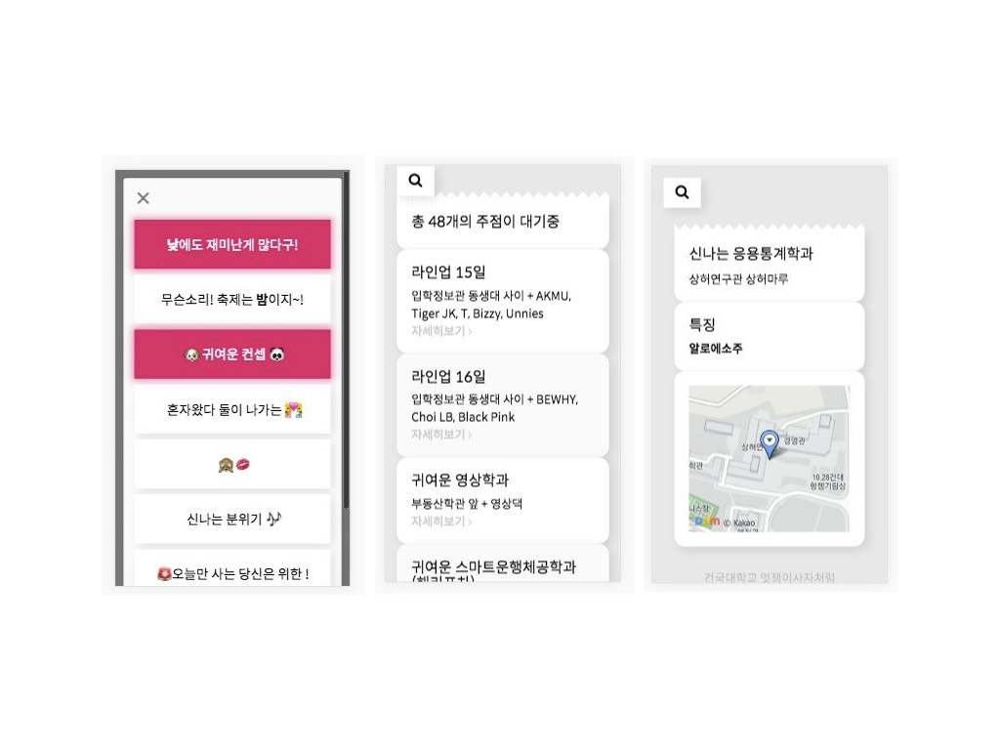

# 건국대학교 대동제(축제) 안내 페이지

## Gem

- [devise](https://github.com/plataformatec/devise) : 사용자 회원가입, 로그인, 로그아웃, 회원탈퇴, 권한인증 라이브러리
- [figaro](https://github.com/laserlemon/figaro) : 환경 변수 관리(secret key 관리)
- [paperclip](https://github.com/thoughtbot/paperclip) : 간단한 파일 첨부 라이브러리
- [searchkick](https://github.com/ankane/searchkick) : 검색 관련 라이브러리(elastic search사용)
- [omniauth](https://github.com/omniauth/omniauth) : 인증(타 소셜 로그인)
    - [omniauth-facebook](https://github.com/mkdynamic/omniauth-facebook) : 페이스북 로그인

## 역할

- 정다혜
    - facebook 연동
    - 채팅 기능
    - 모델링
    - 페이지 디자인 초안

- 우미연
    - 검색기능(searchkick)
        - searchkick, daum map api 연동

- 천민우
    - 디자인
    - 마크업 : UI 변경
    - deploy(aws ec2)

[project 진행 과정](./schedule.md)